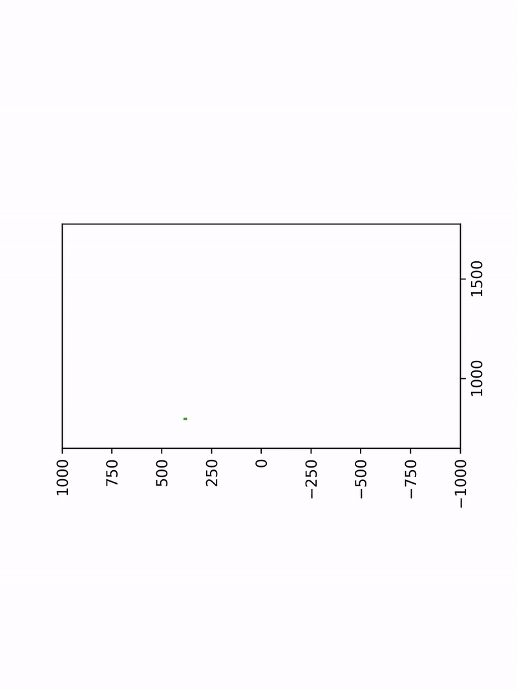

# svg2gcode

Turn this:

directly into lines to be plotted by Line-us:

## Install

You need the following requirements:

- python (3.6+)
- potrace
- ffmpeg
- imagemagick

On Windows you can install with scoop:

	scoop install potrace ffmpeg imagemagick python3

On Linux you can install with apt:
	
	sudo apt install potrace ffmpeg imagemagick python3

Once installed,  you can install the required Python packages with pip:

	python3 -m pip install -r requirements.txt

## Run

## Notes

The determined ares are from [Line-us Drawing Area](https://github.com/Line-us/Line-us-Programming/blob/master/Documentation/LineUsDrawingArea.pdf).

## License

MIT